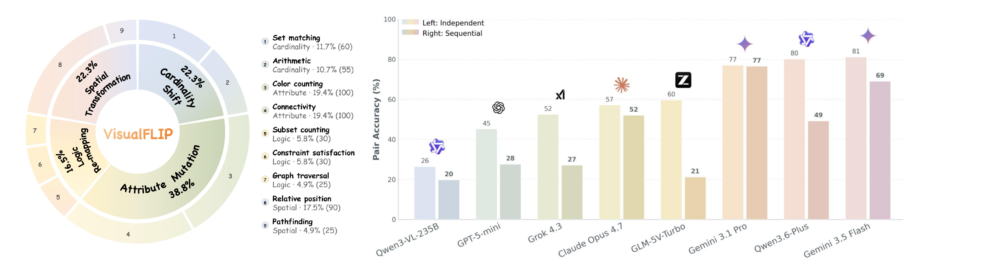
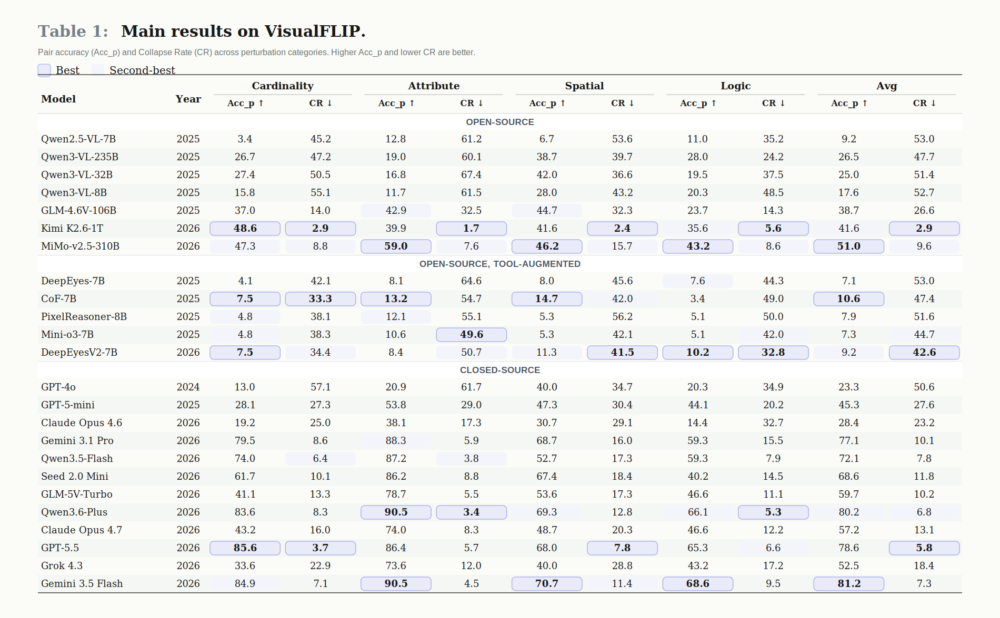
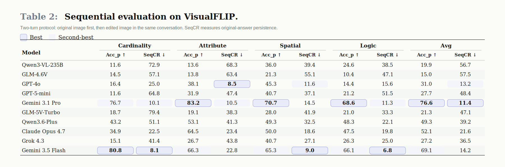

<div align="center">

# VisualFLIP

**Do Predictions Depend on Task-Critical Visual Evidence in Multimodal Reasoning?**

[](https://didizhu-judy.github.io/VisualFLIP/)
[](https://huggingface.co/datasets/didizhu-judy/VisualFLIP)
[](https://huggingface.co/spaces/didizhu-judy/VisualFLIP)
[](LICENSE)
[](DATA_LICENSE)



</div>

---

When a multimodal LLM answers a visual reasoning question correctly, *would* the prediction still
update if the task-critical visual evidence changed? Accuracy on a single image can't tell.

**VisualFLIP** turns this into an answer-updating test. Every item in the benchmark is a **pair of
images** that share the **same question**, but the second image makes a **minimal task-critical
edit** so the gold answer **deterministically flips**. A prediction that is sensitive to the
edited evidence should change; a prediction that repeats the original answer on both images
*collapses*. The benchmark is behavioural — it measures whether predictions move with the
evidence, not the internal mechanism behind any individual answer.

We report two pair-level metrics: **pair accuracy (Acc<sub>p</sub>)** — both sides right — and
**Collapse Rate (CR)** — how often a model that solves at least one side gives the *same* non-empty
answer to both images despite the gold flipping.

---

## At a glance

| | |
|---|---|
| **Pairs** | **687** (515 synthetic + 172 real-image from MathVision) |
| **Images** | 1,374 paired + 140 irrelevant-edit controls |
| **Categories** | Cardinality (146), Attribute (273), Spatial (150), Logic (118) |
| **Templates** | 13 synthetic generators + 1 real-image set |
| **Metric** | Acc<sub>p</sub> ↑  /  Collapse Rate (CR) ↓ |
| **Models evaluated in paper** | 24 (open-source / tool-augmented / closed-source) |

The synthetic subset is procedurally generated, so the "original" vs "edited" label is symmetric.
Each pair flips a single task-critical visual attribute (a count, a color, a spatial relation, …)
while keeping question text and surrounding context fixed.

<details>
<summary><b>Per-template counts (click)</b></summary>

| Category | Template | n |
|---|---|---:|
| Cardinality | hard_dense_count | 30 |
| Cardinality | hard_dense_5panel | 30 |
| Cardinality | stem_count_match | 30 |
| Cardinality | stem_sum_match | 25 |
| Cardinality | real-MathVision | 31 |
| Attribute | color_connectivity | 100 |
| Attribute | attr_dense_5panel | 50 |
| Attribute | attr_dense_color_count | 50 |
| Attribute | real-MathVision | 73 |
| Spatial | layer_order | 60 |
| Spatial | nested_containment | 30 |
| Spatial | maze_path | 25 |
| Spatial | real-MathVision | 35 |
| Logic | logic_set_count | 30 |
| Logic | narrative_multi | 30 |
| Logic | logic_arrow_path | 25 |
| Logic | real-MathVision | 33 |

</details>

---

## Quick start

### 1) Pull the dataset

The images live on Hugging Face (≈530 MB). Mirror them locally:

```bash
pip install -U huggingface_hub
python scripts/download_data.py --out ./visualflip_data
```

Or grab the manifest only, for inspection:

```bash
python scripts/download_data.py --manifest-only --out ./visualflip_data
head -1 ./visualflip_data/manifest.jsonl | python -m json.tool
```

### 2) Run an evaluation (OpenRouter)

```bash
export VISUALFLIP_DATA=./visualflip_data
export OPENROUTER_API_KEY=sk-or-...

# strong model — full 687 pairs. evaluate.py auto-bumps max-tokens to 8192 for
# color_connectivity and maze_path (the two long-context templates); other templates
# get the default 4096.
python scripts/evaluate.py --model google/gemini-2.5-flash \
    --out results/gemini25flash.json

# weak model — skip the two long-context templates and tighten the default budget
python scripts/evaluate.py --model qwen/qwen2.5-vl-7b-instruct \
    --exclude-templates color_connectivity,maze_path \
    --max-tokens 2048 --out results/qwen25vl7b.json
```

### 3) Compute Acc<sub>p</sub> and CR

```bash
python scripts/aggregate.py results/*.json
```

Output (excerpt):

```
=== gemini25flash ===
  OVERALL                          n= 687  Acc_p= 81.2  Acc= 88.8  CR=  7.3  ...
  -- by category --
  Cardinality                      n= 146  Acc_p= 84.9  CR=  7.1
  Attribute                        n= 273  Acc_p= 90.5  CR=  4.5
  Spatial                          n= 150  Acc_p= 70.7  CR= 11.4
  Logic                            n= 118  Acc_p= 68.6  CR=  9.5
```

---

## Evaluation protocol (independent mode)

For every pair, the **same question** is asked on `original_image` and on `edited_image` as **two
separate completions** — *not* a multi-turn conversation. The exact prompt:

```
Think step by step. Put your reasoning in <thinking></thinking> and ONLY the final answer
in <answer></answer>. Question: {question}
```

The extracted answer is the first match in this order: `<answer>…</answer>`, `\boxed{…}`, a trailing
letter (A–E) or integer on the last line. **Truncation handling (default):** if `finish_reason ==
"length"` *and* no `<answer>` tag was emitted, the prediction is treated as empty. A response that
emitted `<answer>X</answer>` and then truncated *after* still counts as `X`. Pass
`--strict-truncation` to invalidate **any** length-truncated response (paper-faithful
reproduction).

The two templates `color_connectivity` and `maze_path` need **≥ 8192 max-tokens** (they require long
global tracing). Weak models can skip them with `--exclude-templates color_connectivity,maze_path`.

---

## Evaluation Results

<p align="center">
  
</p>

<p align="center">
  
</p>

The SVG tables above reproduce the paper's main Table 1 and Table 2 in README-friendly form.
Table 1 reports independent pair accuracy and Collapse Rate across perturbation categories; Table 2
reports the sequential two-turn diagnostic with pair accuracy and SeqCR. Full 24-model results are on the
[project page](https://didizhu-judy.github.io/VisualFLIP/).

<details>
<summary><b>Top-10 independent-mode numeric table</b></summary>

<!-- LEADERBOARD:START -->
| # | Model | Year | Acc<sub>p</sub> ↑ | CR ↓ |
|---:|---|---:|---:|---:|
| 1 | Gemini 3.5 Flash | 2026 | **81.2** | 7.3 |
| 2 | Qwen3.6-Plus | 2026 | 80.2 | 6.8 |
| 3 | GPT-5.5 | 2026 | 78.6 | 5.8 |
| 4 | Gemini 3.1 Pro | 2026 | 77.1 | 10.1 |
| 5 | Qwen3.5-Flash | 2026 | 72.1 | 7.8 |
| 6 | Seed 2.0 Mini | 2026 | 68.6 | 11.8 |
| 7 | GLM-5V-Turbo | 2026 | 59.7 | 10.2 |
| 8 | Claude Opus 4.7 | 2026 | 57.2 | 13.1 |
| 9 | Grok 4.3 | 2026 | 52.5 | 18.4 |
| 10 | MiMo-v2.5-310B | 2026 | 51.0 | 9.6 |
| … | (full table on project page) | | | |
<!-- LEADERBOARD:END -->

> *To regenerate this top-10 table from `data/leaderboard.json` after adding new
> results, run `python tools/sync_leaderboard.py --write`.*

</details>

---

## Data format

`manifest.jsonl` — one record per pair:

```json
{
  "id": "hard_dense_count_30000",
  "source": "synthetic",                      // synthetic | real_mathvision
  "category": "Cardinality",                  // Cardinality | Attribute | Spatial | Logic
  "template": "hard_dense_count",             // null for real_mathvision
  "question": "How many apples are there in the picture?",
  "answer_original": 4,
  "answer_edited": 3,
  "original_image": "Cardinality/hard_dense_count_30000_original.png",
  "edited_image":   "Cardinality/hard_dense_count_30000_edited.png",
  "release_status": "OOD-synthetic-v2",

  // present on 140 pairs only (3 templates have an irrelevant-edit control arm):
  "irrelevant_image": "controls/hard_dense_count_30000_irrelevant.png",
  "answer_irrelevant": 4,
  "has_control": true
}
```

All paths are relative to the dataset root (the directory `download_data.py` writes into). Answers
are letters (A–E) or integers — compare case-insensitively, strip whitespace.

## Citation

```bibtex
@article{zhu2026visualflip,
  title   = {VisualFLIP: Do Predictions Depend on Task-Critical Visual Evidence in Multimodal Reasoning?},
  author  = {Zhu, Didi and Chen, Changrui and Zafeiriou, Stefanos and Deng, Jiankang},
  year    = {2026},
  journal = {arXiv preprint},
  note    = {Code and data: https://github.com/didizhu-judy/VisualFLIP}
}
```

The 172 real-image pairs are derived from **MathVision** (Wang et al., 2024); please also cite that
work if you use the `source == "real_mathvision"` subset:

```bibtex
@article{wang2024mathvision,
  title  = {Measuring Multimodal Mathematical Reasoning with MATH-Vision Dataset},
  author = {Wang, Ke and others},
  year   = {2024}
}
```

---

## License

* **Code** — MIT (see [LICENSE](LICENSE)).
* **Data** — CC BY 4.0 for the 515 synthetic pairs (see [DATA_LICENSE](DATA_LICENSE)).
* **Real-image subset (172 pairs)** — inherits the upstream MathVision license. If your downstream
  use has stricter licensing constraints, filter to `source == "synthetic"`.

---

## Contact

Issues and pull requests welcome on GitHub. For research collaboration:
[`dzhu@ic.ac.uk`](mailto:dzhu@ic.ac.uk) (Imperial College London).
