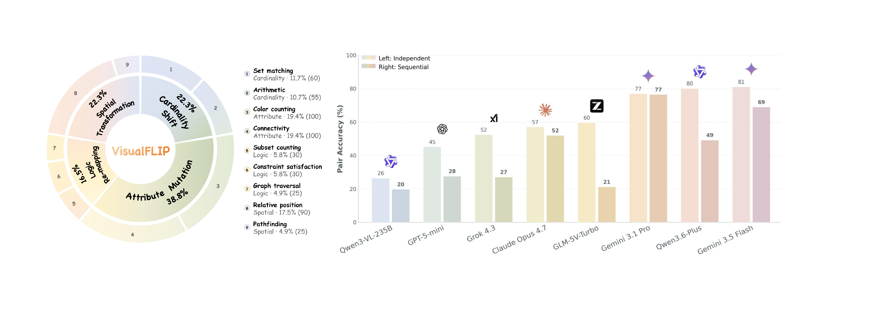

<div align="center">

# VisualFLIP

**Do Predictions Depend on Task-Critical Visual Evidence in Multimodal Reasoning?**

[](https://didizhu-judy.github.io/VisualFLIP/)
[](LICENSE)



</div>

---

When a multimodal LLM answers a visual reasoning question correctly, *would* the prediction still
update if the task-critical visual evidence changed? Accuracy on a single image can't tell.

**VisualFLIP** turns this into an answer-updating test. Every item in the benchmark is a **pair of
images** that share the **same question**, but the second image makes a **minimal task-critical
edit** so the gold answer **deterministically flips**. A prediction that is sensitive to the
edited evidence should change; a prediction that repeats the original answer on both images
*collapses*. The benchmark is behavioural — it measures whether predictions move with the
evidence, not the internal mechanism behind any individual answer.

---

## At a glance

| | |
|---|---|
| **Pairs** | **687** paired image-flips |
| **Images** | 1,374 paired + 140 irrelevant-edit controls |
| **Categories** | Cardinality (146), Attribute (273), Spatial (150), Logic (118) |
| **Templates** | 14 task templates across 4 categories |
| **Metric** | Acc<sub>p</sub> ↑  /  Collapse Rate (CR) ↓ |
| **Models evaluated in paper** | 24 (open-source / tool-augmented / closed-source) |

Each pair flips a single task-critical visual attribute (a count, a color, a spatial relation, …)
while keeping the question text and surrounding context fixed; the "original" vs "edited" label is symmetric.

> **Release status.** The dataset and the maintained evaluation harness will be released upon publication of the paper. The leaderboard below and the [project page](https://didizhu-judy.github.io/VisualFLIP/) reflect the results reported in the paper.

---

## Evaluation Results

**Top-10 independent-mode numeric table**

<!-- LEADERBOARD:START -->
| # | Model | Year | Acc<sub>p</sub> ↑ | CR ↓ |
|---:|---|---:|---:|---:|
| 1 | Gemini 3.5 Flash | 2026 | **81.2** | 7.3 |
| 2 | Qwen3.6-Plus | 2026 | 80.2 | 6.8 |
| 3 | GPT-5.5 | 2026 | 78.6 | 5.8 |
| 4 | Gemini 3.1 Pro | 2026 | 77.1 | 10.1 |
| 5 | Qwen3.5-Flash | 2026 | 72.1 | 7.8 |
| 6 | Seed 2.0 Mini | 2026 | 68.6 | 11.8 |
| 7 | GLM-5V-Turbo | 2026 | 59.7 | 10.2 |
| 8 | Claude Opus 4.7 | 2026 | 57.2 | 13.1 |
| 9 | Grok 4.3 | 2026 | 52.5 | 18.4 |
| 10 | MiMo-v2.5-310B | 2026 | 51.0 | 9.6 |
<!-- LEADERBOARD:END -->

The full 24-model leaderboard (independent and sequential evaluation, per-category breakdown) is on the [project page](https://didizhu-judy.github.io/VisualFLIP/#results).

---

## Citation

```bibtex
@article{zhu2026visualflip,
  title   = {VisualFLIP: Do Predictions Depend on Task-Critical Visual Evidence in Multimodal Reasoning?},
  author  = {Zhu, Didi and Chen, Changrui and Zafeiriou, Stefanos and Deng, Jiankang},
  year    = {2026},
  journal = {arXiv preprint}
}
```
